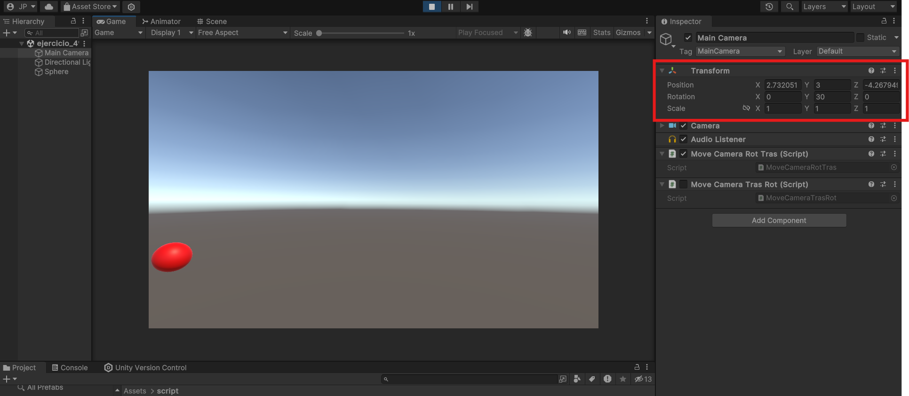
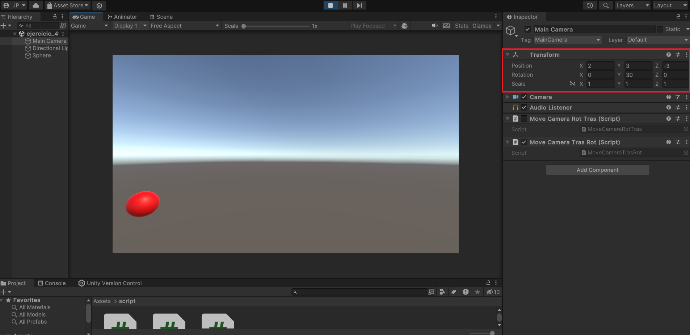
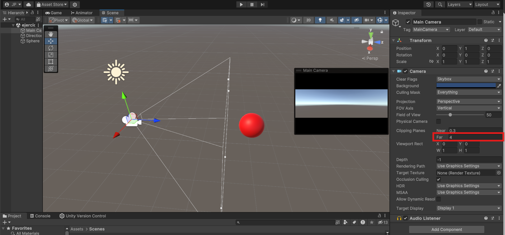
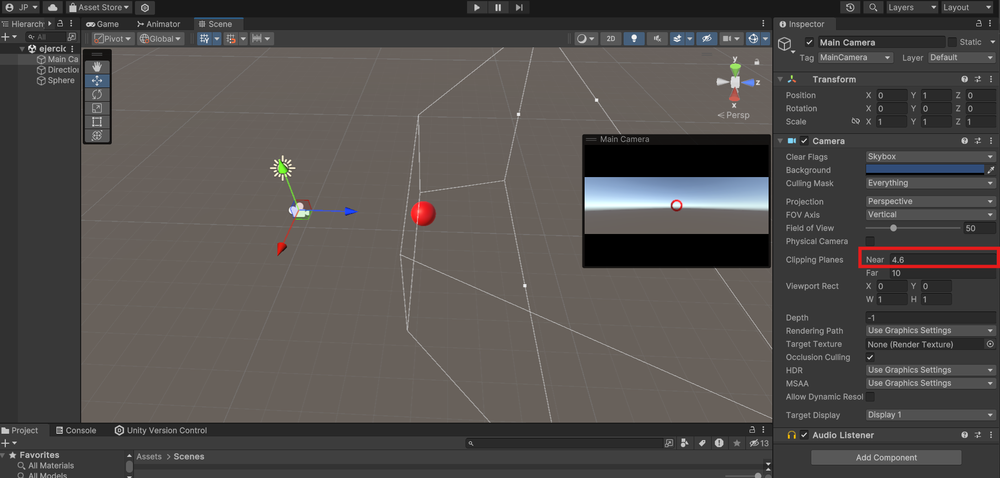
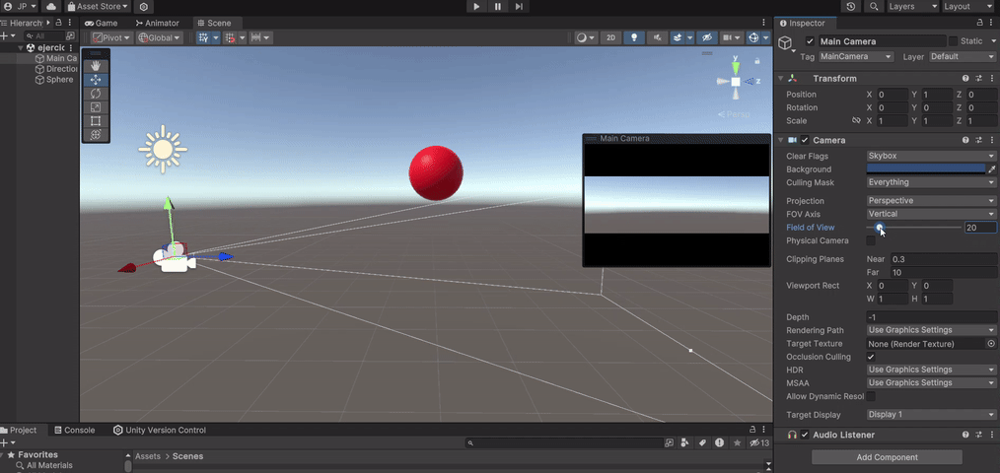
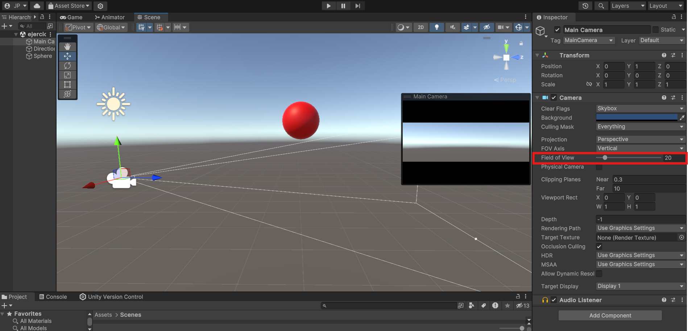

# Seminario 3: Mundos virtuales. Introducción a la programación de gráficos 3D.

1. [Pregunta 1](#1)
2. [Pregunta 2](#2)
3. [Pregunta 3](#3)
4. [Pregunta 4](#4)
5. [Pregunta 5](#5)
6. [Pregunta 6](#6)
7. [Pregunta 7](#7)
8. [Pregunta 8](#8)
9. [Pregunta 9](#9)
10. [Pregunta 10](#10)
11. [Pregunta 11](#11)
12. [Pregunta 12](#12)
13. [Pregunta 13](#13)
14. [Pregunta 14](#14)
15. [Pregunta 15](#15)
16. [Pregunta 16](#16)
17. [Pregunta 17](#17)

## Pregunta 1 <div id='1'/>

**1\. Qué funciones se pueden usar en los scripts de Unity para llevar a cabo traslaciones, rotaciones y escalados.**

En Unity, para manejar las transformaciones básicas como traslación, rotación y escalado de objetos en un script de C\#, se utilizan principalmente los métodos de la clase `Transform`, asociada a cada GameObject en la escena. A continuación se detallan las funciones más comunes:

### **Traslación (Movimiento)**

* `transform.Translate(Vector3 translation)`: Mueve el objeto en la dirección y magnitud especificadas por el vector `translation`.  
* `transform.position`: Ajustando esta propiedad, se cambia directamente la posición global del objeto en el espacio 3D.  
* `transform.localPosition`: Permite modificar la posición en relación con su padre.

### **Rotación**

* `transform.Rotate(Vector3 eulerAngles)`: Rota el objeto basado en los ángulos de Euler especificados.  
* `transform.rotation`: Permite establecer la rotación absoluta en términos de `Quaternion`, útil para rotaciones suaves y precisas.  
* `transform.RotateAround(Vector3 point, Vector3 axis, float angle)`: Rota el objeto alrededor de un punto específico (`point`) sobre un eje dado (`axis`) a un ángulo determinado.

### **Escalado**

* `transform.localScale`: Modifica el tamaño del objeto en el espacio local ajustando esta propiedad de escala.

## Pregunta 2 <div id='2'/>

**2\. Cómo trasladarías la cámara 2 metros en cada uno de los ejes y luego la rotas 30º alrededor del eje Y?. Rota la cámara alrededor del eje Y 30ª y desplázala 2 metros en cada uno de los ejes. ¿Obtendrías el mismo resultado en ambos casos?. Justifica el resultado.**

Para resolver esta pregunta, vamos a analizar dos operaciones: trasladar la cámara 2 metros en cada eje y rotarla 30º alrededor del eje Y. La diferencia radica en el orden en que aplicamos estas transformaciones, y este orden es fundamental debido a la naturaleza de las transformaciones en 3D, que no son conmutativas.

### Código de ejemplo en C\#

Supongamos que tenemos una referencia a la cámara en una variable `cameraTransform` (de tipo `Transform`). La implementación de ambos casos sería algo como esto:

1. **Primero traslación, luego rotación**:

```c
cameraTransform.Translate(2f, 2f, 2f); // Traslada la cámara 2 metros en cada eje.
cameraTransform.Rotate(0f, 30f, 0f);   // Rota la cámara 30° alrededor del eje Y.
```

2. **Primero rotación, luego traslación**:

```c
cameraTransform.Rotate(0f, 30f, 0f);   // Rota la cámara 30° alrededor del eje Y.
cameraTransform.Translate(2f, 2f, 2f); // Traslada la cámara 2 metros en cada eje.
```

### ¿El resultado es el mismo en ambos casos?

No, **el resultado no es el mismo** debido a la forma en que se aplican las transformaciones.

1. **Primero traslación, luego rotación**:  
     
   - Cuando movemos la cámara 2 metros en cada eje, su posición cambia en el espacio global.  
   - Después, al aplicar la rotación, la cámara rota en su nueva posición, girando sobre el eje Y **global** (si no especificamos un eje local).

   

2. **Primero rotación, luego traslación**:  
     
   - La rotación inicial gira la cámara 30º alrededor del eje Y en su lugar.  
   - Cuando trasladamos la cámara 2 metros en cada eje después de la rotación, este movimiento ocurre en el sistema de coordenadas local, que ahora está girado 30º respecto al eje Y global.

### Justificación del resultado

Las transformaciones en Unity, cuando se aplican en el orden de rotación y luego traslación, modifican el sistema de coordenadas local de la cámara. En el primer caso, la traslación ocurre en el sistema global antes de la rotación, mientras que en el segundo caso, la traslación se aplica en el sistema de coordenadas ya rotado.

Este comportamiento está alineado con las reglas de transformaciones en gráficos 3D, donde el orden de las transformaciones afecta el resultado final debido a que son operaciones no conmutativas.
| Rotación y traslación          | Traslación y rotación                   |
|--------------------------------------------------|------------------------------------------------|
|           |           |
## Pregunta 3 <div id='3'/>

**3\. Sitúa la esfera de radio 1 en el campo de visión de la cámara y configura un volumen de vista que la recorte parcialmente.**

### Posicionar la esfera en el campo de visión de la cámara

- Supongamos que tienes una cámara en la escena con una posición inicial en `(0, 0, 0)` y mirando hacia adelante (en el eje Z positivo).  
- Crea una esfera con un radio de 1 unidad y ubícala en una posición visible en el campo de visión de la cámara. Por ejemplo, coloca la esfera en `(0, 1, 5)`. Esta posición la coloca a 5 unidades frente a la cámara y centrada en el eje Y de la cámara, lo cual la hace visible.

### Configurar el volumen de vista para recortar la esfera parcialmente

Unity utiliza un sistema de recorte basado en el volumen de vista o "frustum" de la cámara, que tiene seis planos de recorte: **frontal, trasero, superior, inferior, izquierdo y derecho**. Para recortar parcialmente la esfera, puedes ajustar los planos de recorte de la cámara o modificar su FOV (Field of View).

#### Ajuste del plano frontal y trasero

- Ve a la configuración de la cámara (`Camera` component en Unity).  
- Modifica los valores de `Near Clip Plane` y `Far Clip Plane`:  
  - El `Near Clip Plane` define la distancia mínima a la que los objetos serán visibles desde la cámara. Ajustando este valor cerca de la esfera, recortarás una porción de ella.  
  - Por ejemplo, si colocas la esfera en `(0, 1, 1.5)` y configuras el `Near Clip Plane` en `1.4`, el plano de recorte frontal corta una sección de la esfera, mostrando solo una porción de la misma.

#### Ajuste del campo de visión (FOV)

- Puedes reducir el FOV de la cámara para recortar los bordes de la esfera en el eje horizontal o vertical.  
- Por ejemplo, al reducir el FOV vertical a un valor cercano a los bordes de la esfera (aproximadamente 20-30 grados si la esfera está a 5 unidades de distancia), los bordes de la esfera se recortarán en el frustum sin perderse completamente.

### Visualización 

Para comprobar el efecto de recorte:

1. Activa la opción **Gizmos** en la ventana de la cámara de escena para ver los planos de recorte.  
2. Ajusta los parámetros del `Near Clip Plane` y `Far Clip Plane`, o modificar el `FOV` hasta lograr el recorte deseado.

Este enfoque te permite crear el efecto de una esfera parcialmente visible en el frustum de la cámara, simulando el recorte de un volumen de vista.
| Modificación del Field of View                   | Configuración del Clip Plane                   |
|--------------------------------------------------|------------------------------------------------|
|           |           |
## Pregunta 4 <div id='4'/>

**4\. Sitúa la esfera de radio 1 en el campo de visión de la cámara y configura el volumen de vista para que la deje fuera de la vista.**

### Método 1: Ajustar los planos de recorte

Si ya tienes la esfera ubicada en el campo de visión de la cámara, por ejemplo, en la posición `(0, 1, 5)`:

1. **Alejar el plano de recorte cercano** (`Near Clip Plane`):  
     
   - Ajusta el `Near Clip Plane` de la cámara a un valor más cercano a la esfera que su posición. Por ejemplo, si la esfera está en el eje Z a `5` unidades de la cámara, coloca el `Near Clip Plane` en `5.1` o más.  
   - Esto provoca que cualquier objeto que esté a menos de `5.1` unidades de la cámara sea recortado, lo que incluye a la esfera.

   

2. **Ajustar el plano de recorte lejano** (`Far Clip Plane`):  
     
   - Alternativamente, si la esfera está en una posición más lejana, puedes reducir el `Far Clip Plane` para que la esfera quede fuera del rango de visión de la cámara.  
   - Por ejemplo, si la esfera está en `(0, 1, 20)`, ajusta el `Far Clip Plane` a `19` o menos. Esto recorta cualquier objeto más allá de `19` unidades, dejando la esfera fuera de la vista.

### Método 2: Modificar el campo de visión (FOV)

Otra opción es manipular el campo de visión de la cámara, reduciendo el ángulo de visión vertical u horizontal, de forma que la esfera quede fuera del volumen de vista.

1. **Reducir el FOV vertical**:  
     
   - Si la esfera está en una posición elevada o desviada respecto al centro del frustum de la cámara (por ejemplo, `(0, 2, 5)`), reduce el campo de visión vertical de la cámara (`Field of View`) hasta que la esfera quede fuera de la vista.  
   - Para esto, disminuye el FOV a un valor inferior (por ejemplo, de 60º a 30º) hasta que los límites del frustum de la cámara ya no incluyan la posición de la esfera.

   

2. **Cambiar la posición de la esfera**:  
     
   - Alternativamente, puedes posicionar la esfera fuera del frustum desplazándola hacia los lados. Coloca la esfera a la izquierda o derecha (por ejemplo, en `(2, 0, 5)`) y ajusta el campo de visión horizontal de la cámara si es necesario.

### Visualización 

Para verificar los cambios en Unity:

- Activa **Gizmos** en la vista de la cámara para observar los límites del frustum.  
- Asegúrate de ajustar los valores poco a poco hasta lograr que la esfera esté completamente fuera de los límites del volumen de vista.

| Modificación del Cliping Plane Far               | Configuración del Cliping Plane Near                   |
|--------------------------------------------------|------------------------------------------------|
|           |           |

| Movimiento del FOV                | Reducción del FOV                   |
|--------------------------------------------------|------------------------------------------------|
|           |        |
## Pregunta 5 <div id='5'/>

**5\. Cómo puedes aumentar el ángulo de la cámara. Qué efecto tiene disminuir el ángulo de la cámara**

Para modificar el ángulo de apertura de la cámara en Unity, puedes ajustar el **campo de visión vertical** o **Field of View (FOV)** de la cámara. Esto se puede hacer directamente en el componente `Camera` del inspector o mediante código en un script, modificando la propiedad `Camera.fieldOfView`.

```c
Camera.main.fieldOfView = 60f; // Ejemplo: ajustar el FOV a 60 grados
```

### Efectos de manipular en ángulo de la cámara

1. **Aumentar el ángulo de la cámara (FOV)**:  
     
   - Cuando aumentas el campo de visión, la cámara captura un área más amplia de la escena. Esto hace que los objetos se vean más pequeños, ya que abarcan una mayor porción del entorno en la misma vista.  
   - Aumentar el FOV es útil para panorámicas o para simular una lente gran angular, pero puede causar distorsión en los bordes de la imagen, lo que se percibe como un efecto de "ojo de pez".

   

2. **Disminuir el ángulo de la cámara (FOV)**:  
     
   - Reducir el FOV estrecha el área visible, acercando la vista y haciendo que los objetos se vean más grandes y más cercanos, como si estuvieran más cerca de la cámara.  
   - Este efecto es ideal para enfoques detallados de objetos o cuando se busca destacar un área específica sin incluir distracciones del entorno, similar a una lente teleobjetivo. Sin embargo, puede dar una sensación de menor profundidad, ya que reduce la perspectiva.

## Pregunta 6 <div id='6'/>

**6\. Es correcta la siguiente afirmación: Para realizar la proyección al espacio 2D, en el inspector de la cámara, cambiaremos el valor de projection, asignándole el valor de orthographic**

La afirmación es **correcta**. En Unity, al cambiar el modo de proyección de la cámara a **Orthographic** desde el inspector, efectivamente se configura para realizar una **proyección ortogonal**. En este tipo de proyección, los objetos mantienen sus proporciones independientemente de su distancia a la cámara, lo que significa que no se aplica la perspectiva, y los objetos se ven en su tamaño real sin distorsión de profundidad.

En contraste, la configuración de **Perspective** permite que los objetos cercanos a la cámara se vean más grandes y los objetos lejanos se vean más pequeños, lo que simula la percepción real de profundidad en el espacio 3D, ideal para videojuegos y simulaciones realistas.

## Pregunta 7 <div id='7'/>

**7\. Especifica las rotaciones que se han indicado en los ejercicios previos con la utilidad quaternion**

En Unity, las rotaciones con la utilidad **Quaternion** permiten manejar rotaciones de manera más efectiva, especialmente para evitar problemas como el "gimbal lock" que puede ocurrir con rotaciones en ángulos de Euler. Basándonos en los ejercicios previos, aquí tienes cómo expresar esas rotaciones utilizando `Quaternion`.

### Ejemplo 1: Rotación de 30° alrededor del eje Y

En un ejercicio previo, se indicó una rotación de **30° alrededor del eje Y**. Para realizar esta rotación con `Quaternion`, utilizamos:

```c
transform.rotation = Quaternion.Euler(0f, 30f, 0f);
```

Esto crea un `Quaternion` a partir de ángulos de Euler, donde:

- `0f` es la rotación en el eje X,  
- `30f` es la rotación en el eje Y,  
- `0f` es la rotación en el eje Z.

### Ejemplo 2: Concatenar rotación y traslación

En otro ejercicio, se pidió rotar un objeto **30° alrededor del eje Y** y luego aplicarle una traslación. Con `Quaternion`, podemos componer rotaciones de esta forma para agregar más de una rotación, si fuera necesario, y mantener la misma precisión:

1. Primero, definimos la rotación en `Quaternion`.

```c
Quaternion rotation = Quaternion.Euler(0f, 30f, 0f);
```

2. Luego, aplicamos esta rotación al objeto antes o después de la traslación, según lo especificado en el ejercicio.

```c
transform.rotation = rotation;
transform.Translate(2f, 2f, 2f);
```

### Ejemplo de rotación compuesta

Si tuvieras que aplicar varias rotaciones en secuencia, por ejemplo, **30° en Y y luego 45° en Z**, puedes combinarlas con la multiplicación de `Quaternion`:

```c
Quaternion rotationY = Quaternion.Euler(0f, 30f, 0f);
Quaternion rotationZ = Quaternion.Euler(0f, 0f, 45f);
transform.rotation = rotationY * rotationZ;
```

En este caso:

- `rotationY` rota el objeto 30° alrededor del eje Y.  
- `rotationZ` rota el objeto 45° alrededor del eje Z.  
- La multiplicación `rotationY * rotationZ` aplica primero `rotationY` y luego `rotationZ`.

## Pregunta 8 <div id='8'/>

**8\. ¿Cómo puedes averiguar la matriz de proyección en perspectiva que se ha usado para proyectar la escena al último frame renderizado?**

Para averiguar la **matriz de proyección en perspectiva** utilizada para proyectar la escena en el último frame renderizado en Unity, puedes acceder a esta información a través de la cámara de la escena. En Unity, cada cámara tiene una matriz de proyección que determina cómo se proyectan los objetos 3D en la pantalla 2D. Aquí te explico cómo obtener esta matriz:

### Paso 1: Acceder a la cámara y obtener su matriz de proyección

Unity proporciona acceso a la **matriz de proyección** de la cámara mediante la propiedad `Camera.projectionMatrix`. Puedes obtener esta matriz en tiempo de ejecución para verificar los valores que se están utilizando en el último frame renderizado.

### Ejemplo de código en C\#

El siguiente código te muestra cómo acceder y mostrar la matriz de proyección en perspectiva de la cámara principal:

```c
void Start()
{
    // Acceder a la cámara principal
    Camera mainCamera = Camera.main;

    // Obtener la matriz de proyección en perspectiva
    Matrix4x4 projectionMatrix = mainCamera.projectionMatrix;

    // Mostrar la matriz en la consola
    Debug.Log("Matriz de proyección de la cámara:\n" + projectionMatrix);
}
```

### Detalles sobre la matriz de proyección en perspectiva

Esta matriz de proyección (`Matrix4x4`) es una matriz de 4x4 que Unity utiliza para transformar coordenadas del espacio 3D de la cámara al espacio 2D de la pantalla. La matriz tiene en cuenta:

- El **campo de visión** vertical (Field of View, FOV).  
- La **relación de aspecto** de la cámara.  
- Los **planos de recorte cercano y lejano** (Near y Far Clip Planes).

## Pregunta 9 <div id='9'/>

**9\. ¿Cómo puedes averiguar la matriz de proyección en perspectiva ortográfica que se ha usado para proyectar la escena al último frame renderizado?**

Para averiguar la **matriz de proyección ortográfica** que se ha utilizado para proyectar la escena al último frame renderizado en Unity, puedes acceder a esta información directamente desde la cámara de la escena, similar al proceso con la proyección en perspectiva. En el caso de una proyección ortográfica, Unity ajusta la matriz de proyección para que los objetos mantengan sus proporciones sin importar su distancia a la cámara.

### Paso 1: Asegurarte de que la cámara está en modo ortográfico

Primero, debes verificar que la cámara esté configurada en modo ortográfico. Esto se hace configurando la propiedad `orthographic` de la cámara a `true`.

```c
Camera.main.orthographic = true; // Activa el modo ortográfico si no está activado
```

### Paso 2: Obtener la matriz de proyección ortográfica

La matriz de proyección en modo ortográfico se puede obtener de la misma manera que en el modo de perspectiva, usando la propiedad `Camera.projectionMatrix`. Este código captura la matriz de proyección ortográfica en el último frame renderizado:

```c
void Start()
{
    // Acceder a la cámara principal
    Camera mainCamera = Camera.main;

    // Verificar que la cámara esté en modo ortográfico
    if (mainCamera.orthographic)
    {
        // Obtener la matriz de proyección ortográfica
        Matrix4x4 orthoProjectionMatrix = mainCamera.projectionMatrix;

        // Mostrar la matriz en la consola
        Debug.Log("Matriz de proyección ortográfica de la cámara:\n" + orthoProjectionMatrix);
    }
    else
    {
        Debug.LogWarning("La cámara no está en modo ortográfico.");
    }
}
```

### Detalles sobre la matriz de proyección ortográfica

En modo ortográfico, la matriz de proyección tiene en cuenta:

- El **tamaño ortográfico** (`Camera.orthographicSize`), que controla la altura del volumen de vista ortográfico.  
- La **relación de aspecto** de la cámara.  
- Los **planos de recorte cercano y lejano** (`Near Clip Plane` y `Far Clip Plane`).

La matriz ortográfica proyecta los objetos sin distorsión de perspectiva, lo que significa que los objetos se mantienen en el mismo tamaño independientemente de su distancia a la cámara.

## Pregunta 10 <div id='10'/>

**10\. ¿Cómo puedes obtener la matriz de transformación entre el sistema de coordenadas local y el mundial?**

En Unity, la **matriz de transformación entre el sistema de coordenadas local y el mundial** de un objeto se puede obtener usando la propiedad `localToWorldMatrix` del componente `Transform`. Esta matriz convierte las coordenadas de un objeto desde su sistema de referencia local (específico del objeto) al sistema de referencia mundial (global en la escena).

### Ejemplo de código en C\#

Para obtener esta matriz, puedes acceder a `localToWorldMatrix` del `Transform` del objeto de interés:

```c
void Start()
{
    // Acceder al componente Transform del objeto
    Transform objectTransform = GetComponent<Transform>();

    // Obtener la matriz de transformación local a mundial
    Matrix4x4 localToWorld = objectTransform.localToWorldMatrix;

    // Mostrar la matriz en la consola
  Debug.Log("Matriz de transformación de local a mundial:\n" + localToWorld);
}
```

### Detalles sobre la matriz `localToWorldMatrix`

La matriz `localToWorldMatrix` es una **matriz de 4x4** que contiene toda la información necesaria para transformar cualquier punto o vector desde el espacio local del objeto al espacio global. Esta matriz incluye:

- **Traslación**: la posición del objeto en el espacio mundial.  
- **Rotación**: la orientación del objeto relativa al espacio mundial.  
- **Escalado**: la escala aplicada al objeto en relación con el mundo.

Esta matriz se compone de los elementos de transformación del objeto (`position`, `rotation`, `scale`) y realiza la conversión en un solo paso.

### Transformación inversa: De mundial a local

Si necesitas la transformación inversa (del sistema mundial al local del objeto), Unity también proporciona la matriz `worldToLocalMatrix`. Esto puede ser útil si tienes una posición o dirección en el espacio mundial y deseas expresarla en el sistema de coordenadas local del objeto:

```c
Matrix4x4 worldToLocal = objectTransform.worldToLocalMatrix;
Debug.Log("Matriz de transformación de mundial a local:\n" + worldToLocal);
```

## Pregunta 11 <div id='11'/>

**11\. ¿Cómo puedes obtener la matriz para cambiar al sistema de referencia de vista?**

Para obtener la **matriz de transformación hacia el sistema de referencia de vista** en Unity, necesitas acceder a la **matriz de vista** de la cámara activa. Esta matriz transforma los objetos de la escena desde el sistema de coordenadas mundial al sistema de referencia de la cámara, también conocido como espacio de vista. En Unity, la **matriz de vista** se representa con la propiedad `worldToCameraMatrix` en el componente `Camera`.

### Acceso a la Matriz de Vista (worldToCameraMatrix)

La propiedad `Camera.worldToCameraMatrix` proporciona la matriz que transforma las coordenadas de cualquier objeto desde el espacio mundial al sistema de coordenadas de la cámara:

```c
void Start()
{
    // Acceder a la cámara principal
    Camera mainCamera = Camera.main;

    // Obtener la matriz de vista (world to camera)
    Matrix4x4 viewMatrix = mainCamera.worldToCameraMatrix;

    // Mostrar la matriz en la consola
    Debug.Log("Matriz de vista (world to camera):\n" + viewMatrix);
}
```

### Detalles sobre la matriz `worldToCameraMatrix`

La matriz `worldToCameraMatrix` es una **matriz de 4x4** que realiza varias transformaciones en un solo paso:

- **Traslación**: ajusta la posición de los objetos en relación con la posición de la cámara.  
- **Rotación**: ajusta la orientación de los objetos en función de la orientación de la cámara.

Esta matriz es crucial en el pipeline de gráficos 3D, ya que es el primer paso para proyectar objetos 3D en una pantalla 2D desde el punto de vista de la cámara.

### Transformación inversa: De vista a mundial

Si necesitas la transformación inversa, es decir, convertir coordenadas desde el sistema de referencia de vista al sistema de referencia mundial, Unity proporciona la propiedad `cameraToWorldMatrix`. Esto es útil para operaciones que requieren volver a proyectar puntos de la vista de la cámara al espacio global.

```c
Matrix4x4 viewToWorldMatrix = mainCamera.cameraToWorldMatrix;
Debug.Log("Matriz de transformación de vista a mundial:\n" + viewToWorldMatrix);
```

## Pregunta 12 <div id='12'/>

**12\. Especifica la matriz de la proyección usado en un instante de la ejecución del ejercicio 1 de la práctica 1\.**

Para especificar la **matriz de proyección** usada en un instante de ejecución para el ejercicio descrito (una escena básica en 3D en Unity), necesitamos considerar el tipo de cámara y los parámetros de proyección establecidos. Asumiendo que estás usando una cámara configurada en **proyección de perspectiva** (el modo predeterminado para escenas en 3D en Unity), la matriz de proyección refleja esta configuración de perspectiva.

### Obtener la matriz de proyección en tiempo de ejecución

Para capturar la matriz de proyección en perspectiva utilizada por la cámara en un momento específico de la ejecución, puedes utilizar el siguiente script en C\# para obtener y mostrar la matriz de proyección en la consola:

```c
using UnityEngine;

public class ProjectionMatrixLogger : MonoBehaviour
{
    void Start()
    {
        // Acceder a la cámara principal
        Camera mainCamera = Camera.main;

        // Verificar que la cámara está en modo de proyección perspectiva
        if (!mainCamera.orthographic)
        {
            // Obtener y mostrar la matriz de proyección en perspectiva
            Matrix4x4 projectionMatrix = mainCamera.projectionMatrix;
            Debug.Log("Matriz de proyección en perspectiva:\n" + projectionMatrix);
        }
        else
        {
            Debug.LogWarning("La cámara está en modo ortográfico, no en perspectiva.");
        }
    }
}
```

### Explicación de la matriz

La matriz `projectionMatrix` en perspectiva utiliza:

- **FOV (Field of View)**: Define el ángulo vertical de visión de la cámara.  
- **Aspect Ratio**: Relación entre el ancho y la altura de la vista de la cámara.  
- **Near y Far Clip Planes**: Definen el rango de distancias en el que los objetos son visibles desde la cámara.

Por defecto, la **matriz de proyección en perspectiva** se define en Unity mediante el método `Matrix4x4.Perspective`. Puedes también establecer manualmente esta matriz si necesitas un control preciso:

```c
mainCamera.projectionMatrix = Matrix4x4.Perspective(mainCamera.fieldOfView, mainCamera.aspect, mainCamera.nearClipPlane, mainCamera.farClipPlane);
```

### Funcionalidad del script

Al colocar este script en un objeto de la escena, `ProjectionMatrixLogger` mostrará en la consola la matriz de proyección en el instante en que se ejecute el método `Start`. Esto se ajusta a los requisitos de monitoreo en tiempo de ejecución, ya que proporciona un registro de la matriz que se está usando en el momento inicial de la ejecución, correspondiente al instante de la creación de la escena y la configuración de los objetos.

## Pregunta 13 <div id='13'/>

**13\. Especifica la matriz de modelo y vista de la escena del ejercicio 1 de la práctica 1\.**

### 1\. Matriz de modelo (Model Matrix)

La **matriz de modelo** transforma las coordenadas de cada objeto desde su sistema de coordenadas local al sistema de coordenadas mundial de la escena. Esta matriz depende de la posición, rotación y escala de cada objeto y varía para cada uno.

En Unity, la matriz de modelo de un objeto específico se puede obtener mediante el componente `Transform` de dicho objeto usando `localToWorldMatrix`:

```c
Matrix4x4 modelMatrix = objectTransform.localToWorldMatrix;
```

### Ejemplo de código

Dado que el ejercicio requiere un script que escriba en la consola la posición de cada objeto, también puedes utilizarlo para mostrar la matriz de modelo de cada objeto:

```c
using UnityEngine;

public class ModelMatrixLogger : MonoBehaviour
{
    void Start()
    {
        // Obtener todos los objetos en la escena etiquetados para identificar su tipo
        GameObject[] objects = GameObject.FindObjectsOfType<GameObject>();

        foreach (GameObject obj in objects)
        {
            Transform objTransform = obj.transform;

            // Mostrar la posición del objeto
            Debug.Log("Posición del objeto '" + obj.name + "': " + objTransform.position);

            // Obtener y mostrar la matriz de modelo
            Matrix4x4 modelMatrix = objTransform.localToWorldMatrix;
            Debug.Log("Matriz de modelo para el objeto '" + obj.name + "':\n" + modelMatrix);
        }
    }
}
```

### 2\. Matriz de vista (View Matrix)

La **matriz de vista** transforma las coordenadas del sistema mundial al sistema de coordenadas de la cámara. Esta matriz es específica de la cámara activa que observa la escena y depende de su posición y orientación.

En Unity, puedes obtener la matriz de vista de la cámara mediante la propiedad `worldToCameraMatrix` de `Camera`:

```c
Matrix4x4 viewMatrix = Camera.main.worldToCameraMatrix;
```

### Ejemplo de código

Para ver la matriz de vista en la consola, puedes utilizar el siguiente código:

```c
using UnityEngine;

public class ViewMatrixLogger : MonoBehaviour
{
    void Start()
    {
        // Acceder a la cámara principal
        Camera mainCamera = Camera.main;

        // Obtener y mostrar la matriz de vista
        Matrix4x4 viewMatrix = mainCamera.worldToCameraMatrix;
        Debug.Log("Matriz de vista (world to camera) de la cámara principal:\n" + viewMatrix);
    }
}
```

## Pregunta 14 <div id='14'/>

**14\. Aplica una rotación en el start de uno de los objetos de la escena y muestra la matriz de cambio al sistema de referencias mundial**

Para aplicar una rotación en el método `Start` de uno de los objetos de la escena y luego mostrar la **matriz de transformación al sistema de referencias mundial** (la matriz de modelo que refleja esta rotación), sigue estos pasos:

### 1\. Código para aplicar la rotación

```c
using UnityEngine;

public class ApplyRotationAndLogMatrix : MonoBehaviour
{
    void Start()
    {
        // Aplicar una rotación de 45 grados alrededor del eje Y
        transform.Rotate(0f, 45f, 0f, Space.Self);

        // Obtener la matriz de transformación local a mundial después de la rotación
        Matrix4x4 localToWorldMatrix = transform.localToWorldMatrix;

        // Mostrar la matriz en la consola
        Debug.Log("Matriz de transformación de local a mundial después de rotación:\n" + localToWorldMatrix);
    }
}
```

### Explicación del código

- `transform.Rotate(0f, 45f, 0f, Space.Self);` aplica una rotación en el eje Y del objeto, usando su propio sistema de referencia (local).  
- `transform.localToWorldMatrix` proporciona la matriz de transformación que convierte las coordenadas locales del objeto en coordenadas mundiales.  
- La matriz se muestra en la consola, y verás que los elementos de rotación han sido modificados para reflejar la rotación aplicada.

## Pregunta 15 <div id='15'/>

**15\. ¿Cómo puedes calcular las coordenadas del sistema de referencia de un objeto con las siguientes propiedades del Transform? Position (3, 1, 1), Rotation (45, 0, 45\)**

Para calcular las **coordenadas del sistema de referencia** de un objeto en Unity utilizando sus propiedades de `Transform` (posición, rotación y escala), puedes aplicar la matriz de transformación generada por estas propiedades. En Unity, las propiedades `Position`, `Rotation`, y `Scale` del `Transform` se combinan para formar la matriz de transformación `localToWorldMatrix`, que define cómo convertir las coordenadas locales de un objeto a coordenadas en el sistema de referencia mundial.

### Ejemplo en C\# 

Podemos calcular y aplicar estos valores en un script de Unity para obtener y mostrar la matriz de transformación y las coordenadas transformadas.

```c
using UnityEngine;

public class CalculateObjectReferenceSystem : MonoBehaviour
{
    void Start()
    {
        // Definir las propiedades de posición y rotación
        Vector3 position = new Vector3(3, 1, 1);
        Quaternion rotation = Quaternion.Euler(45, 0, 45);

        // Establecer la posición y rotación en el Transform
        transform.position = position;
        transform.rotation = rotation;

        // Obtener la matriz de transformación de local a mundial
        Matrix4x4 localToWorldMatrix = transform.localToWorldMatrix;

        // Mostrar la matriz de transformación en la consola
        Debug.Log("Matriz de transformación de local a mundial:\n" + localToWorldMatrix);

        // Calcular y mostrar las coordenadas del sistema de referencia del objeto en el mundo
        Vector3 localForward = localToWorldMatrix.MultiplyVector(Vector3.forward);
        Vector3 localRight = localToWorldMatrix.MultiplyVector(Vector3.right);
        Vector3 localUp = localToWorldMatrix.MultiplyVector(Vector3.up);

        Debug.Log("Ejes del sistema de referencia del objeto en el mundo:");
        Debug.Log("Eje Forward: " + localForward);
        Debug.Log("Eje Right: " + localRight);
        Debug.Log("Eje Up: " + localUp);
    }
}
```

### Explicación del código

1. **Posición y rotación**:  
     
   - Definimos la `position` como `(3, 1, 1)`.  
   - Creamos un `Quaternion` para la rotación a partir de los ángulos de Euler `(45, 0, 45)`.

   

2. **Matriz de transformación**:  
     
   - Usamos `transform.localToWorldMatrix` para obtener la matriz de transformación del objeto, que combina la posición, rotación y escala, y proyecta el sistema de referencia local en el mundo.

   

3. **Cálculo de los ejes del sistema de referencia del objeto**:  
     
   - `localForward`, `localRight`, y `localUp` son los ejes de referencia del objeto en el sistema mundial, obtenidos al multiplicar los vectores `Vector3.forward`, `Vector3.right`, y `Vector3.up` con la matriz de transformación.

   

4. **Resultado en la consola**:  
     
   - La consola muestra la matriz de transformación y los vectores `Forward`, `Right` y `Up` del objeto en el sistema mundial. Estos vectores representan el sistema de referencia del objeto en el espacio global.

## Pregunta 16 <div id='16'/>

**16\. Investiga sobre los modelo de iluminación que aplica Unity y resume las relaciones existentes con el modelo explicado en clase.**

### Modelos de Iluminación en Unity

1. **Iluminación ambiente**:  
     
   - Unity incluye una iluminación ambiente que proporciona una iluminación base a todos los objetos, incluso en ausencia de luces directas. Esta iluminación es uniforme y simula un entorno donde hay luz reflejada por todo el espacio.  
   - **Relación con el modelo de las diapositivas**: En las diapositivas, se describe la **luz ambiente** como un componente que actúa como un “flash” en una habitación oscura, es decir, una cantidad base de luz que se suma al modelo para que los objetos no queden completamente oscuros.

   

2. **Iluminación difusa (Modelo de Lambert)**:  
     
   - Unity usa el modelo de Lambert para calcular la luz difusa, en el cual la cantidad de luz reflejada depende del ángulo entre la luz incidente y la normal de la superficie. Esto permite que las superficies iluminadas de frente a la luz se vean más brillantes, mientras que los ángulos más oblicuos se ven más oscuros.  
   - **Relación con el modelo de las diapositivas**: El modelo de iluminación difusa en las diapositivas también se basa en el **modelo de Lambert**, donde la luz reflejada es proporcional a la intensidad y al coseno del ángulo entre el rayo incidente y el vector normal.

   

3. **Iluminación especular (Modelo de Phong o Blinn-Phong)**:  
     
   - Unity ofrece el modelo Blinn-Phong para la reflexión especular, que simula los reflejos brillantes sobre superficies pulidas. Este modelo ajusta el brillo en función de la posición del observador y la fuente de luz, generando un reflejo especular que varía en intensidad.  
   - **Relación con el modelo de las diapositivas**: En las diapositivas, se explica que la **luz especular** aporta brillo adicional y depende de la dirección del reflejo y el observador. La intensidad sigue una función basada en el coseno del ángulo, similar a cómo el modelo Blinn-Phong maneja la reflexión en Unity.

   

4. **Sombras y sombreados (Flat, Gouraud, Phong)**:  
     
   - Unity usa varios métodos de sombreado, como el sombreado de Gouraud para interpolar la iluminación entre vértices, y el sombreado de Phong para calcular la iluminación en cada píxel y proporcionar una apariencia más suave.  
   - **Relación con el modelo de las diapositivas**: Las diapositivas describen diferentes técnicas de sombreado: **plano (flat)**, donde el color es uniforme en el polígono; **Gouraud**, que aplica el modelo en los vértices e interpola en el polígono; y **Phong**, que interpola las normales en el polígono y calcula el color por píxel.

   

5. **Iluminación global**:  
     
   - En Unity, el uso de **Global Illumination (GI)** simula cómo la luz rebota en diferentes superficies de la escena, creando efectos de iluminación indirecta. Esto genera una iluminación más realista, especialmente en escenas con superficies reflejantes y espacios cerrados.  
   - **Relación con el modelo de las diapositivas**: La **iluminación global** en las diapositivas también considera tanto la luz directa de las fuentes como la luz reflejada por otros objetos, similar al GI de Unity.

   

6. **Radiosidad**:  
     
   - Aunque Unity no utiliza un modelo de radiosidad exacto, permite simular un efecto de radiosidad mediante la iluminación global y el cálculo de rebotes de luz, que logran un efecto visual similar en tiempo real.  
   - **Relación con el modelo de las diapositivas**: En las diapositivas, el modelo de radiosidad se describe mediante ecuaciones de energía que considera la emisión y absorción de luz de los objetos. Unity simula este concepto en tiempo real para efectos similares sin calcular radiosidad exacta debido a su alto costo computacional.

## Pregunta 17 <div id='17'/>

**17\. Indica las funciones de la API de Unity más importantes respecto a la iluminación**

Unity proporciona diversas funciones y clases en su API para controlar y manipular la iluminación en las escenas. Aquí se destacan las más importantes, basadas en los principios y modelos de iluminación, para gestionar tanto la luz en tiempo real como la iluminación global y sombreado.

### 1\. **Clase `Light`**

La clase `Light` es fundamental para manipular las luces en Unity. Permite crear y configurar distintas fuentes de luz (puntual, direccional, de área, etc.). Algunas de las propiedades y funciones clave de esta clase son:

- **`Light.type`**: Define el tipo de luz (Directional, Point, Spot, Area). Cada tipo tiene diferentes efectos y aplicaciones en la escena.  
- **`Light.intensity`**: Ajusta la intensidad de la luz, controlando su brillo.  
- **`Light.color`**: Establece el color de la luz, influyendo en el tono que proyecta sobre los objetos.  
- **`Light.range`**: Determina el alcance de una luz de tipo `Point` o `Spot`, especificando hasta qué distancia afecta la luz.  
- **`Light.spotAngle`**: Define el ángulo del cono de luz para las luces de tipo `Spot`.  
- **`Light.bounceIntensity`**: Controla la intensidad del rebote de la luz para la **Iluminación Global** (Global Illumination), simulando la luz reflejada en las superficies.  
- **`Light.shadows`**: Activa o desactiva las sombras generadas por la luz, así como el tipo de sombras (Hard, Soft).

Ejemplo de creación y configuración de una luz en código:

```c
Light light = gameObject.AddComponent<Light>();
light.type = LightType.Point;
light.color = Color.white;
light.intensity = 1f;
light.range = 10f;
```

### 2\. **Iluminación global (Global Illumination) y `LightmapSettings`**

Unity permite la simulación de iluminación indirecta mediante la **Iluminación Global**. La clase `LightmapSettings` y funciones asociadas permiten gestionar los lightmaps, que almacenan la iluminación precalculada para reducir el procesamiento en tiempo real.

- **`LightmapSettings.lightmapsMode`**: Define el modo de los lightmaps (NonDirectional, Directional, o Shadowmask).  
- **`LightmapSettings.lightmaps`**: Permite acceder a los lightmaps generados en la escena para personalizar su uso en los objetos.  
- **`LightProbes`**: Clase que permite el uso de **Light Probes**, puntos en el espacio que almacenan información de iluminación y que ayudan a calcular la iluminación de objetos móviles sin lightmaps.

### 3\. **Materiales y sombreado (Shaders)**

Los materiales y sombreadores en Unity interactúan directamente con la iluminación y son esenciales para aplicar los modelos de iluminación (difusa, especular, etc.) en la superficie de los objetos.

- **`Material.SetColor`** y **`Material.SetFloat`**: Estas funciones permiten definir propiedades específicas del material, como el color de la iluminación especular o el brillo.  
- **Shaders Estándar**: Unity ofrece shaders incorporados que responden automáticamente a la iluminación, incluyendo **Standard Shader**, que soporta reflejos, mapas de normales y efectos de fresnel.

Ejemplo de configuración de material con propiedades de iluminación:

```c
Material material = new Material(Shader.Find("Standard"));
material.SetColor("_Color", Color.red);
material.SetFloat("_Glossiness", 0.5f);
```

### 4\. **Funciones para sombras**

Unity permite configurar sombras en tiempo real para aumentar el realismo visual en una escena. Algunos métodos y propiedades clave son:

- **`QualitySettings.shadows`**: Define la calidad de las sombras en la escena (Disable, Hard, Soft).  
- **`Renderer.shadowCastingMode`** y **`Renderer.receiveShadows`**: Permiten habilitar o deshabilitar la proyección y recepción de sombras en objetos específicos.

### 5\. **Renderización e iluminación en tiempo real**

Para gestionar la iluminación en tiempo real y optimizar el rendimiento, Unity ofrece:

- **`DynamicGI`**: Controla la iluminación global en tiempo real y permite actualizar la iluminación cuando se producen cambios en tiempo de ejecución.  
  - **`DynamicGI.UpdateEnvironment`**: Refresca la iluminación global en tiempo real cuando se realizan cambios en la iluminación o los materiales.  
- **`LightProbeGroup`** y **`ReflectionProbe`**: Permiten establecer `Light Probes` y `Reflection Probes`, que capturan la iluminación del entorno y aplican reflejos y sombras en tiempo real para objetos específicos.

### 6\. **Herramientas de iluminación en la interfaz de usuario**

Aunque no son funciones de código directamente, las herramientas de iluminación en la interfaz de Unity son clave para la configuración de iluminación global y local:

- **Panel de Iluminación**: Permite configurar el tipo de iluminación global (Realtime, Baked) y ajustar opciones avanzadas de Lightmaps y Probes.  
- **Baking de Lightmaps**: El "horneado" de iluminación reduce la carga en el procesamiento de tiempo real al precalcular y almacenar los efectos de luz en mapas de texturas.

Estas funciones y clases de la API de Unity permiten crear y manipular diferentes tipos de luces y controlar cómo afectan los materiales y sombras en la escena, siendo fundamentales para implementar correctamente los modelos de iluminación descritos en las diapositivas y en la teoría.
