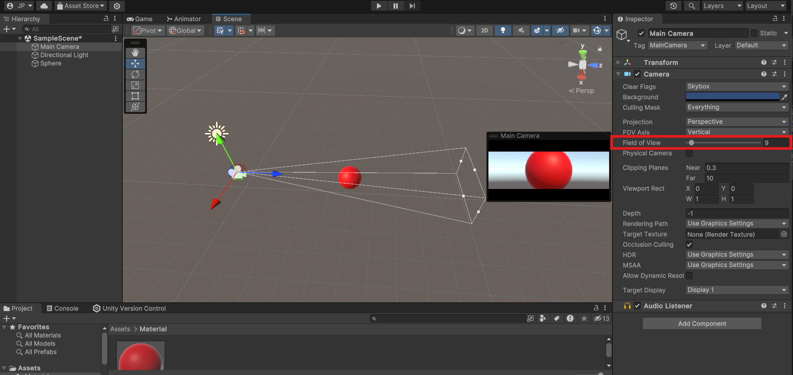
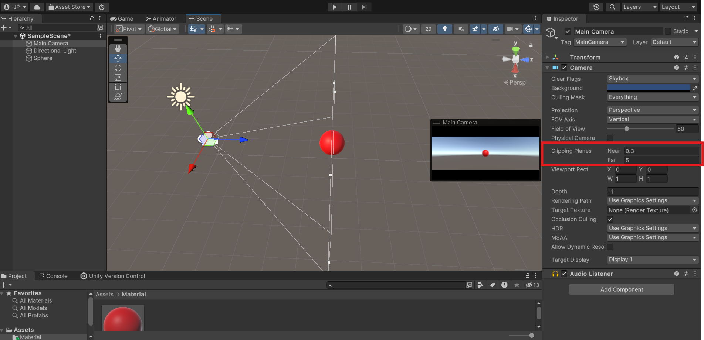

# Seminario 3: Mundos virtuales. Introducción a la programación de gráficos 3D.
## Pregunta 1. Qué funciones se pueden usar en los scripts de Unity para llevar a cabo traslaciones, rotaciones y escalados.
En Unity, para manejar las transformaciones básicas como traslación, rotación y escalado de objetos en un script de C#, se utilizan principalmente los métodos de la clase `Transform`, asociada a cada GameObject en la escena. A continuación se detallan las funciones más comunes:
#### Traslación (Movimiento)
* `transform.Translate(Vector3 translation)`: Mueve el objeto en la dirección y magnitud especificadas por el vector translation.
* `transform.position`: Ajustando esta propiedad, se cambia directamente la posición global del objeto en el espacio 3D.
* `transform.localPosition`: Permite modificar la posición en relación con su padre.
#### Rotación
* `transform.Rotate(Vector3 eulerAngles)`: Rota el objeto basado en los ángulos de Euler especificados.
* `transform.rotation`: Permite establecer la rotación absoluta en términos de Quaternion, útil para rotaciones suaves y precisas.
* `transform.RotateAround(Vector3 point, Vector3 axis, float angle)`: Rota el objeto alrededor de un punto específico (point) sobre un eje dado (axis) a un ángulo determinado.
#### Escalado
* `transform.localScale`: Modifica el tamaño del objeto en el espacio local ajustando esta propiedad de escala.
## Pregunta 2. Cómo trasladarías la cámara 2 metros en cada uno de los ejes y luego la rotas 30º alrededor del eje Y?. Rota la cámara alrededor del eje Y 30ª y desplázala 2 metros en cada uno de los ejes. ¿Obtendrías el mismo resultado en ambos casos?. Justifica el resultado.
Para resolver esta pregunta, vamos a analizar dos operaciones: trasladar la cámara 2 metros en cada eje y rotarla 30º alrededor del eje Y. La diferencia radica en el orden en que aplicamos estas transformaciones, y este orden es fundamental debido a la naturaleza de las transformaciones en 3D, que no son conmutativas.
### Código de ejemplo en C#
Supongamos que tenemos una referencia a la cámara en una variable cameraTransform (de tipo Transform). La implementación de ambos casos sería algo como esto:
1. Primero traslación, luego rotación:
```C++
cameraTransform.Translate(2f, 2f, 2f); // Traslada la cámara 2 metros en cada eje.
cameraTransform.Rotate(0f, 30f, 0f);   // Rota la cámara 30° alrededor del eje Y.
```
2. Primero rotación, luego traslación:
```C++
cameraTransform.Rotate(0f, 30f, 0f);   // Rota la cámara 30° alrededor del eje Y.
cameraTransform.Translate(2f, 2f, 2f); // Traslada la cámara 2 metros en cada eje.
```
### ¿El resultado es el mismo en ambos casos?
No, **el resultado no es el mismo** debido a la forma en que se aplican las transformaciones.
1. Primero traslación, luego rotación:
    - Cuando movemos la cámara 2 metros en cada eje, su posición cambia en el espacio global.
    - Después, al aplicar la rotación, la cámara rota en su nueva posición, girando sobre el eje Y global (si no especificamos un eje local).
2. Primero rotación, luego traslación:
    - La rotación inicial gira la cámara 30º alrededor del eje Y en su lugar.
    - Cuando trasladamos la cámara 2 metros en cada eje después de la rotación, este movimiento ocurre en el sistema de coordenadas local, que ahora está girado 30º respecto al eje Y global.
### Justificación del resultado
Las transformaciones en Unity, cuando se aplican en el orden de rotación y luego traslación, modifican el sistema de coordenadas local de la cámara. En el primer caso, la traslación ocurre en el sistema global antes de la rotación, mientras que en el segundo caso, la traslación se aplica en el sistema de coordenadas ya rotado.

Este comportamiento está alineado con las reglas de transformaciones en gráficos 3D, donde el orden de las transformaciones afecta el resultado final debido a que son operaciones no conmutativas.
**[AÑADIR IMAGENES]**
## Pregunta 3. Sitúa la esfera de radio 1 en el campo de visión de la cámara y configura un volumen de vista que la recorte parcialmente.
### Posicionar la esfera en el campo de visión de la cámara
- Supongamos que tienes una cámara en la escena con una posición inicial en `(0, 0, 0)` y mirando hacia adelante (en el eje Z positivo).
- Crea una esfera con un radio de 1 unidad y ubícala en una posición visible en el campo de visión de la cámara. Por ejemplo, coloca la esfera en `(0, 1, 5)`. Esta posición la coloca a 5 unidades frente a la cámara y centrada en el eje Y de la cámara, lo cual la hace visible.
### Configurar el volumen de vista para recortar la esfera parcialmente
Unity utiliza un sistema de recorte basado en el volumen de vista o "frustum" de la cámara, que tiene seis planos de recorte: **frontal, trasero, superior, inferior, izquierdo y derecho**. Para recortar parcialmente la esfera, puedes ajustar los planos de recorte de la cámara o modificar su FOV (Field of View).
#### Ajuste del plano frontal y trasero
- Ve a la configuración de la cámara (`Camera` component en Unity).
- Modifica los valores de `Near Clip Plane` y `Far Clip Plane`:
    - El `Near Clip Plane` define la distancia mínima a la que los objetos serán visibles desde la cámara. Ajustando este valor cerca de la esfera, recortarás una porción de ella.
    - Por ejemplo, si colocas la esfera en `(0, 1, 1.5)` y configuras el `Near Clip Plane` en `1.4`, el plano de recorte frontal corta una sección de la esfera, mostrando solo una porción de la misma.
#### Ajuste del campo de visión (FOV)
- Puedes reducir el FOV de la cámara para recortar los bordes de la esfera en el eje horizontal o vertical.
- Por ejemplo, al reducir el FOV vertical a un valor cercano a los bordes de la esfera (aproximadamente 20-30 grados si la esfera está a 5 unidades de distancia), los bordes de la esfera se recortarán en el frustum sin perderse completamente.
#### Visualización 
Para comprobar el efecto de recorte:
1. Activa la opción **Gizmos** en la ventana de la cámara de escena para ver los planos de recorte.
2. Ajusta los parámetros del `Near Clip Plane` y `Far Clip Plane`, o modifica el `FOV` hasta lograr el recorte deseado.

Este enfoque te permite crear el efecto de una esfera parcialmente visible en el frustum de la cámara, simulando el recorte de un volumen de vista.
| Modificación del Field of View                   | Configuración del Clip Plane                   |
|--------------------------------------------------|------------------------------------------------|
|           |           |
## Pregunta 4. Sitúa la esfera de radio 1 en el campo de visión de la cámara y configura el volumen de vista para que la deje fuera de la vista.
### Método 1: Ajustar los planos de recorte
Si ya tienes la esfera ubicada en el campo de visión de la cámara, por ejemplo, en la posición `(0, 1, 5)`:
1. **Alejar el plano de recorte cercano** (`Near Clip Plane`):
    - Ajusta el `Near Clip Plane` de la cámara a un valor más cercano a la esfera que su posición. Por ejemplo, si la esfera está en el eje Z a `5` unidades de la cámara, coloca el `Near Clip Plane` en `5.1` o más.
    - Esto provoca que cualquier objeto que esté a menos de `5.1` unidades de la cámara sea recortado, lo que incluye a la esfera.
2. **Ajustar el plano de recorte lejano** (`Far Clip Plane`):
    - Alternativamente, si la esfera está en una posición más lejana, puedes reducir el `Far Clip Plane` para que la esfera quede fuera del rango de visión de la cámara.
    - Por ejemplo, si la esfera está en `(0, 1, 20)`, ajusta el `Far Clip Plane` a `19` o menos. Esto recorta cualquier objeto más allá de `19` unidades, dejando la esfera fuera de la vista.
### Método 2: Modificar el campo de visión (FOV)
Otra opción es manipular el campo de visión de la cámara, reduciendo el ángulo de visión vertical u horizontal, de forma que la esfera quede fuera del volumen de vista.
1. **Reducir el FOV vertical**:
    - Si la esfera está en una posición elevada o desviada respecto al centro del frustum de la cámara (por ejemplo, `(0, 2, 5)`), reduce el campo de visión vertical de la cámara (`Field of View`) hasta que la esfera quede fuera de la vista.
    - Para esto, disminuye el FOV a un valor inferior (por ejemplo, de 60º a 30º) hasta que los límites del frustum de la cámara ya no incluyan la posición de la esfera.
2. **Cambiar la posición de la esfera**:
    - Alternativamente, puedes posicionar la esfera fuera del frustum desplazándola hacia los lados. Coloca la esfera a la izquierda o derecha (por ejemplo, en (2, 0, 5)) y ajusta el campo de visión horizontal de la cámara si es necesario.
### Visualización 
Para verificar los cambios en Unity:
- Activa **Gizmos** en la vista de la cámara para observar los límites del frustum.
- Asegúrate de ajustar los valores poco a poco hasta lograr que la esfera esté completamente fuera de los límites del volumen de vista.
**[AÑADIR IMAGENES]**
## Pregunta 5. Cómo puedes aumentar el ángulo de la cámara. Qué efecto tiene disminuir el ángulo de la cámara
## Pregunta 6. Es correcta la siguiente afirmación: Para realizar la proyección al espacio 2D, en el inspector de la cámara, cambiaremos el valor de projection, asignándole el valor de orthographic
## Pregunta 7. Especifica las rotaciones que se han indicado en los ejercicios previos con la utilidad quaternion
## Pregunta 8. ¿Cómo puedes averiguar la matriz de proyección en perspectiva que se ha usado para proyectar la escena al último frame renderizado?
## Pregunta 9. ¿Cómo puedes averiguar la matriz de proyección en perspectiva ortográfica que se ha usado para proyectar la escena al último frame renderizado?
## Pregunta 10. ¿Cómo puedes obtener la matriz de transformación entre el sistema de coordenadas local y el mundial?
## Pregunta 11. ¿Cómo puedes obtener la matriz para cambiar al sistema de referencia de vista?
## Pregunta 12. Especifica la matriz de la proyección usado en un instante de la ejecución del ejercicio 1 de la práctica 1.
## Pregunta 13. Especifica la matriz de modelo y vista de la escena del ejercicio 1 de la práctica 1.
## Pregunta 14. Aplica una rotación en el start de uno de los objetos de la escena y muestra la matriz de cambio al sistema de referencias mundial
## Pregunta 15. ¿Cómo puedes calcular las coordenadas del sistema de referencia de un objeto con las siguientes propiedades del Transform? Position (3, 1, 1), Rotation (45, 0, 45)
## Pregunta 16. Investiga sobre los modelo de iluminación que aplica Unity y resume las relaciones existentes con el modelo explicado en clase.
## Pregunta 17. Indica las funciones de la API de Unity más importantes respecto a la iluminación
